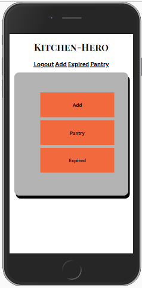
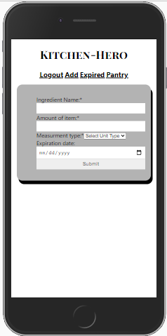

# KITCHEN-HERO
## Link to the live project
* VERCEL URL:    https://kitchen-hero.kayleighkat98.vercel.app/
* HEROKU URL:    https://fierce-hollows-91839.herokuapp.com/ 
## Documentation of the API.
### ROUTES:
* login {POST}
    * '/api/auth'
* user {POST}
    * '/api/user'
* all ingredients {GET, POST}
    * '/api/ingredients'
* all expired {GET} 
    * '/api/ingredients/expired'
* one ingredient {GET, DELETE}
    * '/api/ingredients/:id'
## Screenshot(s)

## Summary
This is the API used by my app Kitchen-Hero. Along with basic user/auth routes and services, this api also stores ingredient information into an online pantry and uses knex instances to filter only expired ingredients to make it easy when cleaning your pantry.
## Technology
### REGULAR DEPENDENCIES:
* bcryptjs
* cors
* dotenv
* express
* helmet
* jsonwebtoken
* knex
* morgan
* pg
* postgrator-cli
* xss
### DEV DEPENDENCIES:
* chai
* mocha
* nodemon
* supertest
### Seed the database

psql -U postgres -d kitchen_hero -f ./seeds/seed.tables.sql

